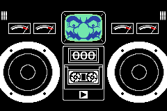
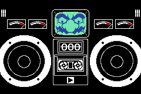

Starting off with the basics, giving you a base for all the other katas. Mash the button to eat the whole banana before the time runs out!

### Criteria

- Draw a banana on the screen.
- On a players input, advance the bananas state one more step in being eaten. Start with taking off the peel, then eating the inside.
- Add a timer with a basic countdown display to zero.
- 
Lose State
 The timer runs out.
- 
Win State
 The player manages to eat the whole banana before the timer runs out.

## Extra Credit

- Add some shake to the banana while it is being eaten. Once the banana is fully eaten, it stops shaking.
- Add some particles when the bananas insides get eaten. Wario is a messy eater!
- Add a background. The original game you're eating a banana in space, but you can choose whatever background you want. Extra extra credit for an animated background.
- Multiple difficulties; The original game required 5 presses for difficulty 1, 6 presses for difficulty 2, and 8 for difficulty 3. But do what you feel is best!
- Make the timer re-usable in your chosen game engine. The timer concept is central to all the Microgames. To help with future katas, making a re-usable timer object now will make things a bit smoother.

## Media

<figure>
  
  <figcaption>Winning a round by finishing off the banana.</figcaption>
</figure>

<figure>
  
  <figcaption>Losing a round by not finishing the banana off in time!</figcaption>
</figure>

## Submissions