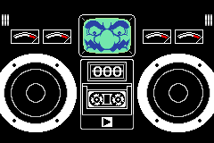
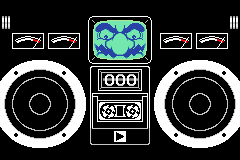

One of the most iconic games in the Warioware series, perfectly nailing its childish tone and playful nature. A finger is moving back and forth in front of a nose. The players goal is to get the finger into the nose, by stopping it at the right moment so its finger can be thrust up directly into a nostril.

## Criteria

- Draw a player character which moves around the nose without the characters interaction.
- Draw a nose with two nostrils for the finger to go into.
- The player presses an input to halt the fingers movement around the nose, and the finger gets moves towards (and hopefully into) the nose from that position.
- 
Lose State
 The finger does not go into one of the nostrils, whether missing the nose completely or hitting the outside/middle of the nose.
- 
Win State
 The finger makes it into one of the nostrils.

## Extra Credit

- Multiple difficulties; The original game uses a pinky finger for difficulty 1, pointer finger for difficulty 2, and two fingers (one for each nostril) for difficulty 3.
- Unique interactions depending on where the finger hits on the nose. E.g. instance hitting the middle turns up the nostrils, but go wild with it!
- 
Lose State
 The timer runs out.

## Media

<figure>
  
  <figcaption>The player winning a round by getting the finger in the nose successfully.</figcaption>
</figure>

<figure>
  
  <figcaption>The player loses a round by hitting the right side of the nose with the finger.</figcaption>
</figure>

## Submissions

| Made By | Engine | Link |
| --- | --- | --- |
|EdwardJFox|Godot 3.4|[GitHub](https://github.com/EdwardJFox/microgame-kata-godot/tree/main/minigames/gold_digger)|

[Submit your kata here](/submit)