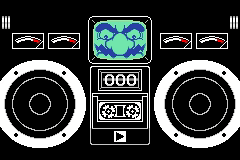
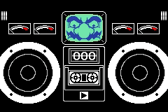

Fruit based Breakout themed action. Stop the watermelon from falling off the bottom of the screen by moving your body to block it!

The player controller a paddle (in the case of the original, a persons body) left and right across the bottom of the screen. The ball (a watermelon) moves down towards the bottom of the screen at a random angle, and the player needs to move the paddle in the way to stop the ball falling off the bottom.

### Criteria

- Add a player paddle, which they can move left and right by using whatever input method you prefer (e.g. controller, keyboard).
- Add a ball/watermelon, which moves at a consistent speed across the screen, bouncing when it hits the walls or the player.
- Have the ball pick a random spot across the top of the screen to start at, and random direction to move in. This means each time the game is loaded, the game is slightly different.
- 
Lose State
 The ball goes past the player, and off the screen.
- 
Win State
 The player survives for the entire length of the timer.

## Extra Credit

- Add some reaction animations for when the players paddle gets hit by the ball.
- Add more difficulties; in the original warioware implementation, the easiest difficulty has the paddle take up about 60% of the screen, and in the hardest it takes up 40% of the screen.

## Media

<figure>
  
  <figcaption>Winning a round keeping the watermelon in the play area for the whole timer.</figcaption>
</figure>

<figure>
  
  <figcaption>Losing a round by letting the watermelon passed the body, and off the bottom of the screen.</figcaption>
</figure>

## Submissions